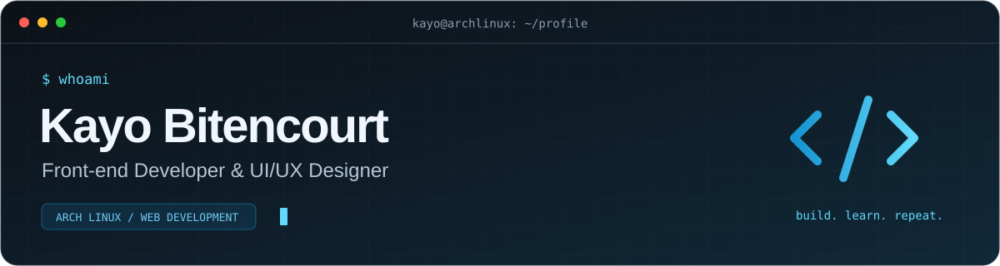

<p align="center">
  
</p>

<p align="center">
  <a href="https://kayobitencourt.dev"></a>
  <a href="mailto:kayobitencourt.dev@gmail.com"></a>
  <a href="https://archlinux.org"></a>
</p>

<table>
  <tr>
    <td width="28%" align="center" valign="middle">
      
    </td>
    <td valign="middle">
      <h3>Olá, eu sou o Kayo.</h3>
      <p>Desenvolvedor com foco em <strong>front-end</strong> e <strong>UI/UX</strong>. Gosto de transformar ideias em interfaces claras, responsivas e com animações que dão personalidade à experiência.</p>
      <p>Trabalho com <strong>React, Next.js e TypeScript</strong> e aprofundo meus conhecimentos em <strong>back-end com Node.js</strong>.</p>
      <p>Estudante de <strong>Análise e Desenvolvimento de Sistemas</strong>. Meu ambiente de desenvolvimento roda <strong>Arch Linux</strong>.</p>
    </td>
  </tr>
</table>

### ~/about

```typescript
const kayo = {
  role: "Front-end Developer & UI/UX Designer",
  os: "Arch Linux",
  focus: ["Interfaces", "Performance", "Animações"],
  learning: ["Node.js", "Arquitetura de APIs"],
  interests: ["Design criativo", "Jogos", "Anime"],
};
```

### ~/stack

**Interfaces**

<p>
  
  
  
  
  
  
  
  
</p>

**APIs e dados**

<p>
  
  
  
  
</p>

**Ferramentas e ambiente**

<p>
  
  
  
  
  
  
  
</p>

Também utilizo **React Hook Form, Zod, Context API e Axios**, com **ESLint, Husky e Conventional Commits** no fluxo de desenvolvimento.

### ~/projects

| Projeto | O que desenvolvo |
| :--- | :--- |
| **[Portfólio](https://kayobitencourt.dev)** | Minha identidade, projetos e experiências com interfaces e animações. |
| **[Laudoparts](https://laudoparts.com)** | Sistema para desmontes e reutilização de peças, com Next.js e diferentes perfis de acesso. |
| **PDV e controle de estoque** | Aplicação em desenvolvimento para vendas, leitura de códigos de barras, estoque e fiado. |

### ~/contact

Tem um projeto em mente? Vamos conversar sobre interfaces, desenvolvimento e boas experiências na web.

**[kayobitencourt.dev](https://kayobitencourt.dev)** · **[kayobitencourt.dev@gmail.com](mailto:kayobitencourt.dev@gmail.com)**

---

<p align="center"><sub>Design com intenção. Código com clareza.</sub></p>
